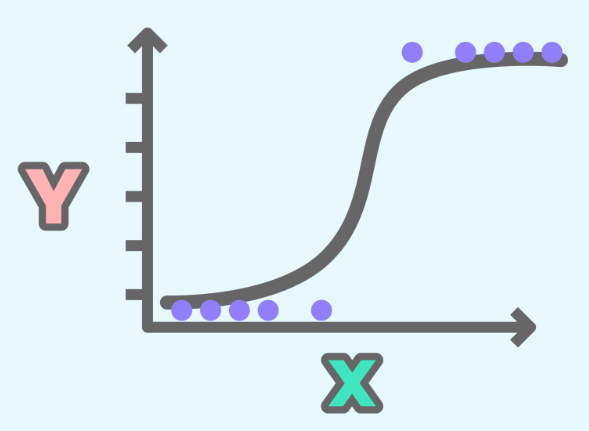
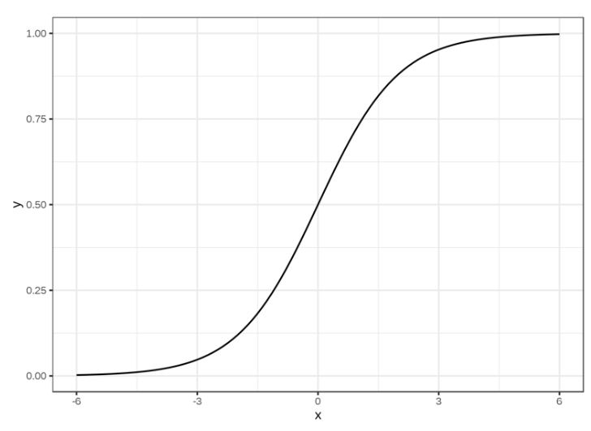

# cardio-vasc-risks

## Contenu du projet.
- **Un fichier ReadMe présentant:**   
    - Le contexte du projet
    - Veille sur la régression logistique.
    - Les données
    - Les analyses
    - La conclusion

- **Un notebook Python `cardio-vasc-risks.ipynb` :**   
  - Analyse Exploratoire de notre jeu de données `cardio_train.csv`
  - Procédé de développement d'un modèle de régression logistique
  - Nettoyage à la modélisation des données
  - Réponse à la problématique posée

## Contexte du projet.
Mieux vaut prévenir que guérir.   

Chaque année en France entre 300 000 et 400 000 accidents cardio-vasculaires surviennent, dont un tiers sont mortels.   
Il n'est plus à démontrer aujourd'hui que l'hygiène de vie d'un individu joue un rôle majeur quant à sa condition et son état de santé.   

Le but de ce projet est de mettre en oeuvre un régression logistique afin d'analyser une variable binaire en fonction d'une variable explicative quantitative.   
Afin de mieux imager la chose, nous nous projettons dans un contexte médical.
À partir d'un jeu de données représentatif d'un panel de la population et caractérisé par un ensemble de variables, nous allons chercher à analyser et prédire les risques cardio-vasculaires.

## Veille sur la régression logistique.

### - La régression logistique, qu'est ce que c'est ? 
La **régression logistique** (ou **modèle logit**) est un modèle statistique permettant d'étudier les relations entre un ensemble de variables catégorielles **X** et une variable catégorielle **y** .  
Il s'agit d'un modèle linéaire généralisé utilisant une fonction logistique comme fonction lien.  
En d'autres termes, un modèle de régression logistique permet de prédire la probabilité qu'un événement arrive (1) ou non (0) à partir de l'optimisation des coefficients de régression.
Le résultat varie toujours entre 0 et 1.

La première mention du modèle logit remonte à **Joseph Berkson** (physicien, médecin et statisticien américain) en 1944 et 1951.  
Il est ainsi considéré comme l'inventeur de la régression logistique.   
Depuis lors, ce modèle est largement utilisé dans de nombreux domaines tels que la médecine, les assurances, l'économétrie et l'apprentissage automatique.

### - La régression logistique dans l'apprentissage automatique.
Au sein de l'apprentissage automatique, la régression logistique appartient à la famille des modèles d'apprentissage automatique supervisé, par opposition aux modèles dit d'apprentissage non-supervisé.   
Elle est également considéré comme un modèle discriminatif, ce qui signifie qu'elle tente de distinguer les classes (ou catégories).   

### - Mathématiquement, comment ça se traduit ?
Considétons une entrée :  
### **$X = x_1, x_2, x_3, ... , x_N$**   
la régression logistique a pour objectif de trouver une fonction h, telle que nous puissions calculer :   
### **y= {1 si hX≥ seuil, O si h< seuil}**   
On comprend ainsi que ce que l'on attend de notre fonction h, c'est qu'elle soit une probabilité comprise entre 0 et 1, paramétrée par = 1, 2, 3, N à optimiser et que le seuil que nous définissions correspond à notre critère de classification (généralement pris comme valant 0.5).   
- **Fonction logistique :**  
La fonction qui remplit le mieux ces conditions est la **fonction sigmoïde**, définie sur R à valeurs dans [0,1] et qui s'écrit de la manière suivante :   
$$σ(x) = \frac{1}{1 + e^{-x}} = p$$
- **Graphiquement :**  
elle correspond à une **courbe en forme de S** qui a pour limite 0 et 1 lorsque x tend respectivement vers -∞ et +∞ passant par y = 0.05 en x = 0.   

  

- Pour une seule variable explicative **X** , l'équation de la courbe logistique est : 
$$P(X) = \frac{{\exp(\beta_0 + \beta_1X)}}{{1 + \exp(\beta_0 + \beta_1X)}}$$

### - Il existe trois types de modèles de régression logistique.
- **Régression logistique binaire** :   
Dans cette approche, la réponse (variable dépendante ou variable expliquée) est de nature dichotomique, c'est à dire qu'elle n'a que deux résultats possibles : 0 ou 1 / vraie ou fausse.
Un exemple populaire de son utilisation est la prédiction de la nature d'un mail afin de déterminer si ce dernier est un spam ou pas.  
Dans la régression logistique, c'est l'approche la plus couramment utilisée, et plus généralement, c'est l'un des classificateurs les plus courants pour la classification binaire.

- **Régression logistique multinominale** :  
Dans ce type de modèle de régression logistique, la variable dépendante à au moins trois résultats ; ces résultats n'ont cependant pas d'ordre spécifié.
Prenons l'exemple des maisons de disques qui veulent prédire le genre de musique qu'un auditeur est succeptible d'apprécier pour pouvoir le commercialiser et en faire la promotion plus efficacement.  
Un modèle de régression logistique multinominale peut aider la maison de disque à déterminer la force de l'influence que l'âge, le milieu socio-culturel et le sexe d'une personne peuvent avoir sur le type de musique qu'elle préfère. La maison de disques peut alors orienter une campagne publicitaire d'un artiste spécifique vers un groupe de personnes susceptibles de l'écouter.

- **Régression logistique ordinale** :   
Comme pour la régression logistique multinominale, ce type est exploité lorsque la variable de réponse a au moins trois résultats possible à la différence que dans ce cas ; ces valeurs ont un ordre défini.  
Un exemple simple de réponses ordinales serait un système de notation avec des échelles allant de A à F.

### - Cas d'utilisation.
Couramment utilisée pour les problèmes de prédiction et de classification.   
En voici quelques exemples :
- **En médecine :**   
Peut permettre d'identifier les facteurs caractérisant un groupe de sujets malades par rapport à des sujets sains.

- **Dans le domaine des assurances :**   
Peut permettre de cible une fraction de la clientèle sensible à une police d'assurance sur un risque particulier.

- **Dans le domaine bancaire :**   
Peut permettre de détecter les groupes à risque lors de la souscription d'un crédit.

- **En économétrie :**
Peut permettre d'expliquer des variables discrètes, comme les intentions de vote aux élections.
### - Comment l'appliquer ? 
Je vous laisse le plaisir de le découvrir par vous même en explorant ce projet !

### sources :
- https://www.youtube.com/watch?v=yIYKR4sgzI8
- https://www.ibm.com/fr-fr/topics/logistic-regression
- https://datascientest.com/regression-logistique-quest-ce-que-cest
- https://fr.wikipedia.org/wiki/R%C3%A9gression_logistique
- https://delladata.fr/regression-logistique/

## Les données.
Notre jeu de données se compose des variables (colonnes) suivantes :

| Nom de la colonne | Définition | Unité | Type de variable | Type de donnée |   |
|:-----------------:|:----------:|:------|:----------------:|:--------------:|:-:|
| age | âge en nombre de jour | jours  (convertis en années dans le notebook) | Entier (int) | quantitative | discrète
| height | taille en cm | cm | Entier (int) | quantitative | discrète
| weight | poids en kg | kg | Flottant (float) | quantitative | continue
| gender | sexe du patient | 1 = femme    2 = homme | Entier (int) |catégorielle | nominale
|ap_hi | tension artérielle systolique | mmHg* | Entier (int) | quantitative | discrète
| ap_lo | pression sanguine diastolique | mmHg* | Entier (int) | quantitative | discrète
| cholesterol | niveau de cholésterol | 1 = normal   2 = au dessus de la moyenne   3 = bien au dessus de la moyenne | Entier (int) | catégorielle | ordinale
| gluc | niveau de glucose | 1 = normal   2 = au dessus de la moyenne   3 = bien au dessus de la moyenne | Entier (int) | catégorielle | ordinale | 
smoke | état de tabagisme : indique si le patient est un fumeur ou non | 0 = non   1 = oui | Entier (int) | catégorielle | nominale |
alco | consommation d'alcool | 0 = non   1 = oui | Entier (int) | catégorielle | nominale |
active | état d'activité physique | 0 = non   1 = oui | Entier (int) | catégorielle | nominale |
cardio | indique si le patient est sujet à risque cardio-vasculaire | 0 = non   1 = oui | Entier (int) | catégorielle | nominale |

*mmHg : millimètre de Mercure, unité de mesure de la pression